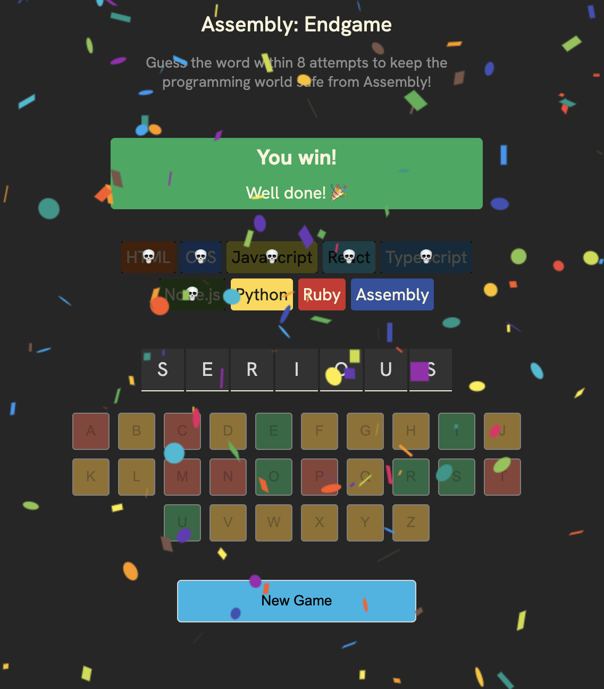
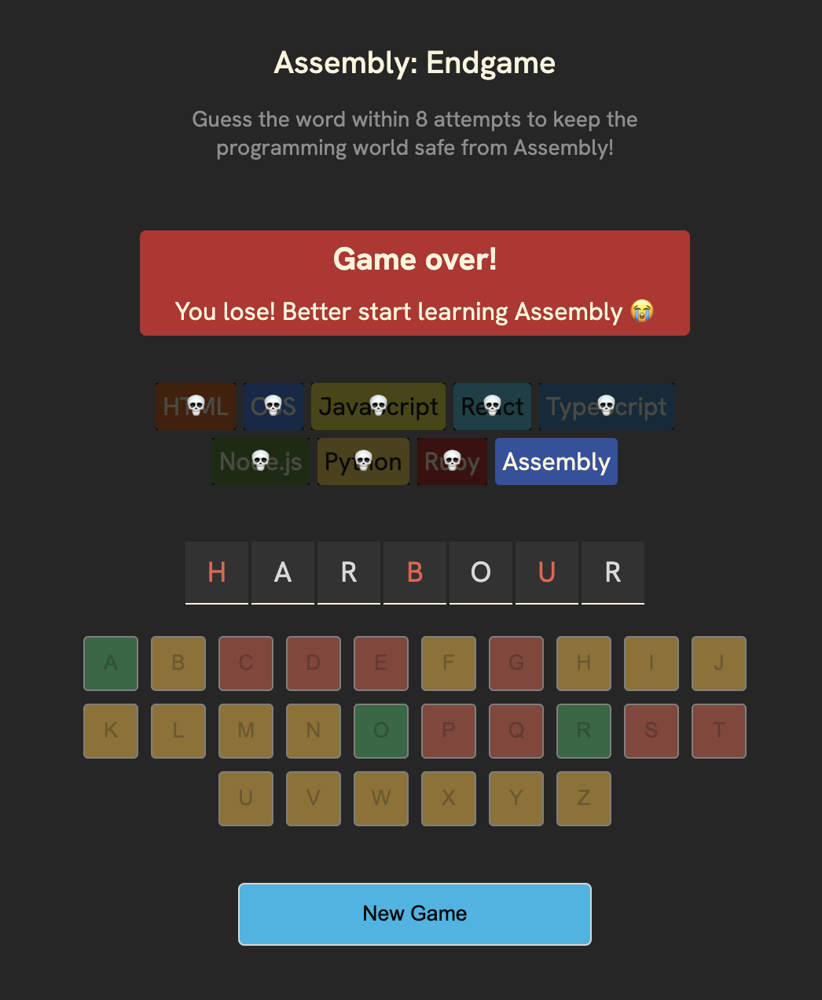
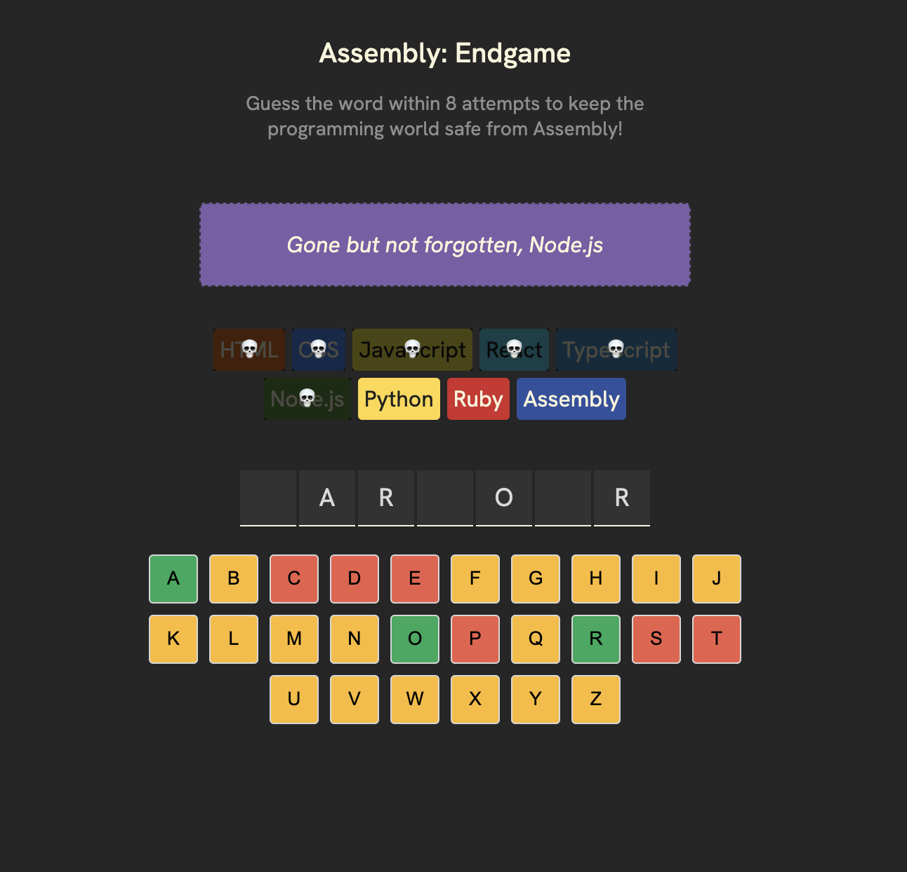

## Dice Game 
A simple word-guessing game built with **React** where players must guess a hidden word within 8 attempts before all programming languages are eliminated!.


The goal of this project is to practice React JS.


[ Let's Try in Live :)](https://gmarav05.github.io/coding-game/)

## Video

## Image

<div align="center">
#Game Won


#Game Lost


#Playing


</div>
##  How to Play

1) **Start the Game** - A random word is selected and displayed as blanks.

2) **Guess Letters** - Click on letters to guess the word.

3) **Track Progress** - Watch as programming languages disappear with wrong guesses.

4) **Win or Lose**:

   **Win**: Guess the word before all 8 languages are eliminated. if you win enjoy confetti.

   **Lose**: Run out of attempts and assembly language reamains.

5) **Play Again** - Click "New Game" to start fresh!


## Features


- Built with React and Vite.

- Interactive word-guessing gameplay.

- Visual feedback for eliminated languages.

- It uses Confetti animation on win using `react-confetti`.

- The game has Accessibility features (uses aria-labels)  and keyboard-friendly.

- Deployable to GitHub Pages.

## Learnings

- Learned how to use React JS Hooks like `useState`.

- Practiced building Component-based architecture.

- Practiced some CSS Flexbox styling.

- Practiced more CSS flexbox.


## Live demo

[ View Live  :)](https://gmarav05.github.io/coding-game/)

## Technology Stack

 **Frontend:** HTML5 + CSS + React 19.

 **Build Tool:** Vite.

 **Deployment:** GitHub Pages.

 **Dependencies:** clsx, react-confetti.


## Accessibility Features

- ARIA labels for interactive elements.

- Screen reader-friendly status announcements.

- Semantic HTML structure.


## Project Structure

```
coding-game/

├── dist/                 # Production build output (auto-generated)
├── node_modules/         # Installed dependencies (auto-generated)
├── public/               # Public assets (optional, for static files)
├── src/
│   ├── App.jsx           # Main game component and logic
│   ├── index.css         # Global styles
│   ├── index.jsx         # Application entry point
│   ├── languages.js      # Programming languages data
│   ├── utils.js          # Utility functions
│   ├── words.js          # Word list for the game
│   └── assets/           # Static assets (images, icons)
├── index.html            # HTML template
├── package.json          # Project dependencies and scripts
├── README.md             # Project documentation
└── vite.config.js        # Vite configuration
```

## Getting Started

### Prerequisites

- Node.js (v16 or higher)
- npm or yarn package manager

## Installation

### Clone the repository
   ```bash
   git clone https://github.com/gmarav05/coding-game.git
   cd coding-game
   ```

### Install dependencies

```sh
npm install
```

### Run locally

```sh
npm run dev
```

### Build for production

```sh
npm run build
```

### Deploy to GitHub Pages

```sh
npm run deploy
```
---

 